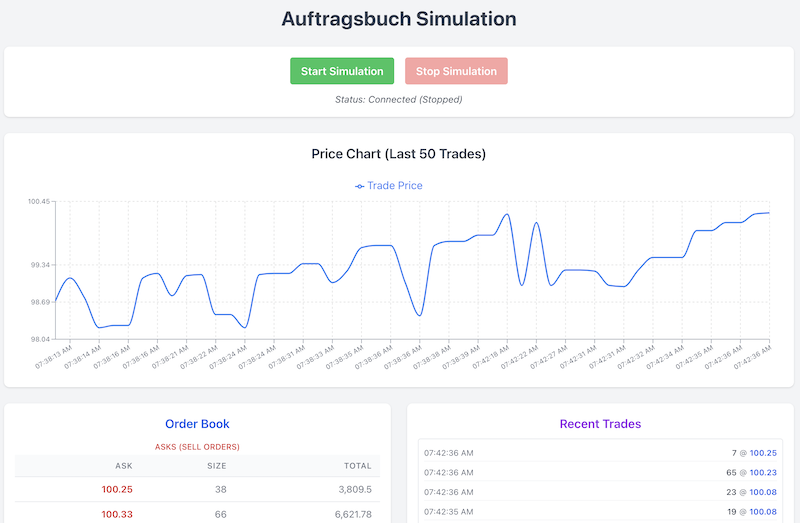

# Auftragsbuch (Order Book) Simulation

 

This project simulates a basic stock exchange order book ("Auftragsbuch" in German) for a single fictional share. It visualizes the price-finding mechanism by processing randomly generated buy and sell orders and updating the display in real-time using WebSockets.

The application features a Node.js/Express backend handling the simulation logic and a React frontend for visualization, styled with Tailwind CSS and including a price chart using Recharts.

## Features

*   **Order Book Display:** Shows current buy (Bids / "Geld") and sell (Asks / "Brief") orders, aggregated by price level.
    *   Bids sorted highest price first.
    *   Asks sorted lowest price first.
    *   Calculates and displays the current spread.
*   **Random Order Generation:** Backend continuously generates random buy/sell orders with varying prices and quantities around a dynamic base price.
*   **Order Matching Engine:** Simple engine on the backend matches incoming orders against the existing book, creating trades when prices overlap.
*   **Real-time Updates:** Uses WebSockets to push order book changes and new trades instantly to the frontend.
*   **Trade Log:** Displays a list of the most recent trades executed.
*   **Price Chart:** Visualizes the price trend of recent trades using Recharts.
*   **Simulation Controls:** Allows starting and stopping the random order generation via the UI.
*   **Modern UI:** Styled using Tailwind CSS utility classes.

## Technology Stack

*   **Backend:**
    *   Node.js
    *   Express.js
    *   `ws` (WebSocket library)
    *   `cors`
*   **Frontend:**
    *   React
    *   Tailwind CSS (via PostCSS)
    *   Recharts (Charting library)
    *   Browser WebSocket API

## Project Structure

```
auftragsbuch/
├── client/             # React Frontend Application
│   ├── public/         # Static assets (index.html, favicon)
│   ├── src/            # React components and source code
│   ├── tailwind.config.js # Tailwind configuration
│   ├── postcss.config.js  # PostCSS configuration
│   └── package.json    # Frontend dependencies
├── server/             # Node.js/Express Backend Application
│   ├── server.js       # Main server logic (Express, WebSocket, Simulation)
│   └── package.json    # Backend dependencies
├── .gitignore          # Git ignore rules
├── package.json        # Top-level scripts (using concurrently)
└── README.md           # This file
```

## Prerequisites

Before you begin, ensure you have the following installed:

* [Node.js](https://nodejs.org/) (includes npm) - Version 16.x or higher recommended.

You can check your installation by running:

```bash
node -v
npm -v
```

## Installation

1.  **Clone the repository:**
    
```bash
git clone <your-repository-url> # Replace with your actual repo URL
cd auftragsbuch
```

2.  **Install all dependencies:**
   
This command installs dependencies for the root project, the server, and the client simultaneously.

```bash
npm run install-all
```

*(This script runs `npm install` in the root, `server/`, and `client/` directories).*

## Running the Application

1.  **Start both backend and frontend servers concurrently:**
    
  From the root `auftragsbuch-app` directory, run:
  
  ```bash
  npm start
  ```
  
This command uses `concurrently` to execute:

* `npm start --prefix server` (Starts the backend on port 3001 by default)
* `npm start --prefix client` (Starts the React development server on port 3000 by default)

2.  **Open the application:**

Open your web browser and navigate to [http://localhost:3000](http://localhost:3000)

3.  **Interact:**
    
* The application will connect to the backend WebSocket server automatically.
* Use the "Start Simulation" button to begin generating random orders and see the order book, trade log, and chart update in real-time.
* Use the "Stop Simulation" button to pause the order generation.

## How It Works

1.  **Backend (`server/server.js`):**
    
* Initializes an Express server and a WebSocket server (`ws`).
* Maintains the state of the `bids`, `asks`, and `trades`.
* Contains the `processOrder` function (matching engine).
* Includes `generateRandomOrder` to create new orders periodically when the simulation is running.
* When an order is processed or a trade occurs, it broadcasts the updated state (`bids`, `asks`, `trades`) to all connected WebSocket clients using `broadcastState`.
* Listens for 'start' and 'stop' messages from clients to control the simulation interval.

2.  **Frontend (`client/src/App.js`):**

* Establishes a WebSocket connection to the backend (`ws://localhost:3001`).
* Listens for messages from the WebSocket server.
* Updates the React state (`bids`, `asks`, `trades`, `isSimulating`) when new data arrives, causing components to re-render.
* Sends 'start' or 'stop' messages to the server when the control buttons are clicked.
* Passes state down to child components (`OrderBook`, `TradeLog`, `PriceChart`, `Controls`) for display.
